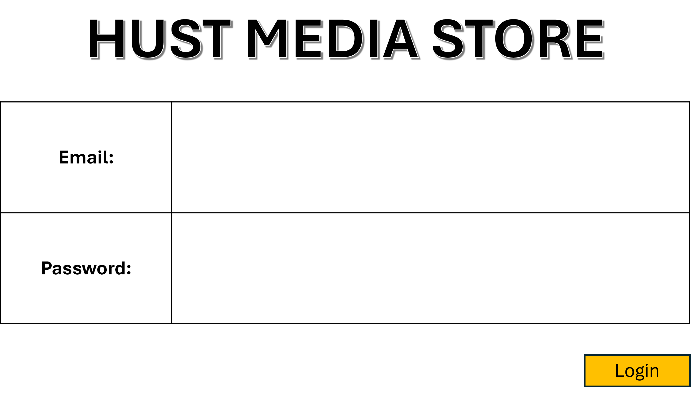

<h1 align="center" style="font-size:24px;">LOG IN SCREEN</h1>

This document serves as an UI detialer for the login screen, the first screen a user sees when they open the application.

As described, a user can either log in as a staff, or as a manager. Each user has a workplace email and a password as their credentials. The workplace email of a staff/manager should be able to indicate whether they are a staff or a manager i.e. staff.name@hms.com.

- Upon opening the application, this screen should be prompted:

- The editing box of each credential should be editable.
- Upon entering the credentials and clicking "Login":
  -  the system should be able to differentiate if the user is a staff or a manager, and update the UI of the app accordingly.
  -  The login screen should be closed, and the screen to register purchases should be opened.