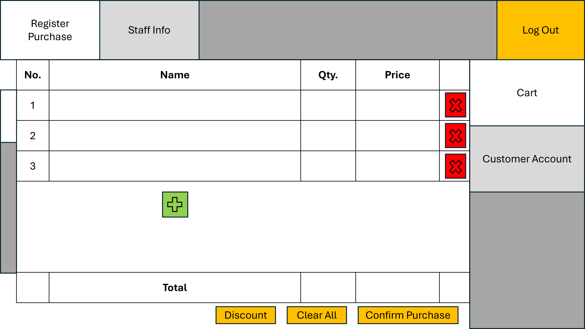
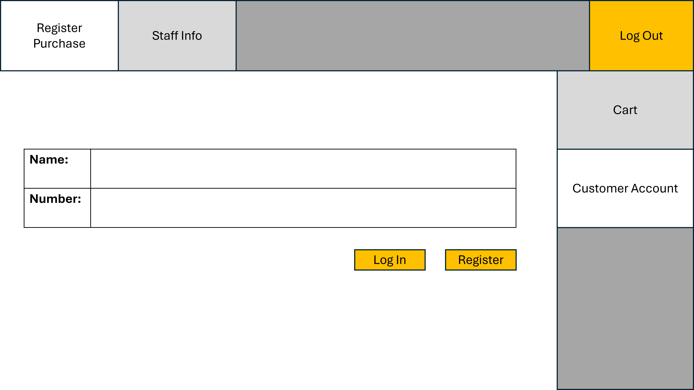
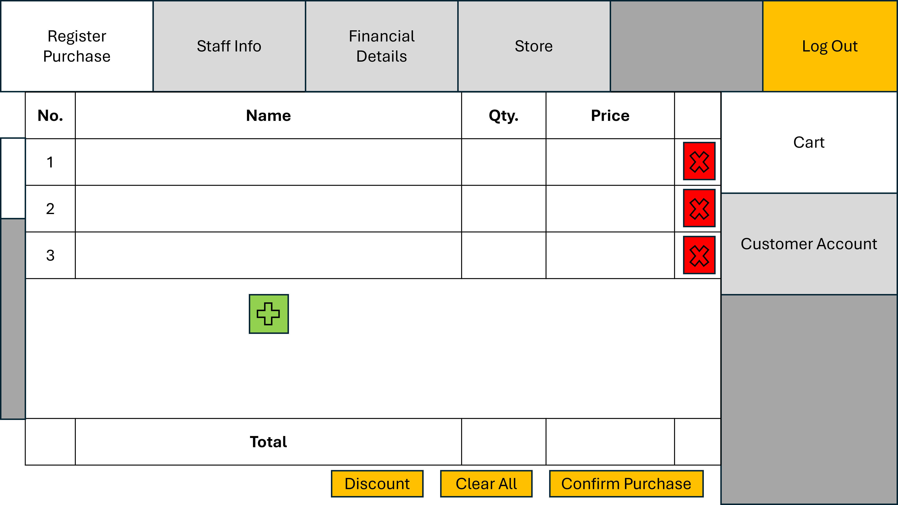

<h1 align="center" style="font-size:24px;">PURCHASE SCREEN</h1>

This document serves as an UI detailer for the purchase screen that staffs use to register a customer's purchase.

The purchase screen has 2 subtabs: the purchase cart, and the customer account menu.

The shades of gray are just to visualize what tabs we are not on here.

**Cart Subtab**

- The weird gray box on the left of the cart screen is supposed to be the scroll controller, which lets us scroll through the current cart. The scroller in this image is currently at the top of the scroll controller.
- The red x-cross button is used to remove the corresponding entry in the cart.
- The green cross button is used to add an entry to the cart.
    - Upon clicking this, we should be prompted with a menu to look for the item to add.
- The "Discount" button will only work if the customer's account is entered.
    - If they have not, we will be prompted with a notification saying the customer's account needs to be entered.
    - if they have, we will be prompted to enter the amount of purchase points to use:
      - The prompt should display the amount of points available
      - The amount of points should be entered
      - There should be a dynamically calculated discount price
- For each entry, the quantity should be entered manually
    - The price of each entry should be updated dynamically
- The "Total" entry should only calculate and display the total prices of all entries

**Customer Account Subtab**

- The name and (phone) number fields will be entered manually.
- The "Register" button should check if the account exists (there is already an account with that name and number in the database) and prompt accordingly.
    - If it already existed, prompt to enter the credentials again.
    - If registered successfully, it should also log the account in.
- The "Log in" button should also check if the account exists and prompt accordingly.
    - If it already existed, log in succcessfully.
    - If it didn't, prompt to enter the credentials again.

**Special: Manager Module**

For manager accounts, the top of the log in session should be changed accordingly:

