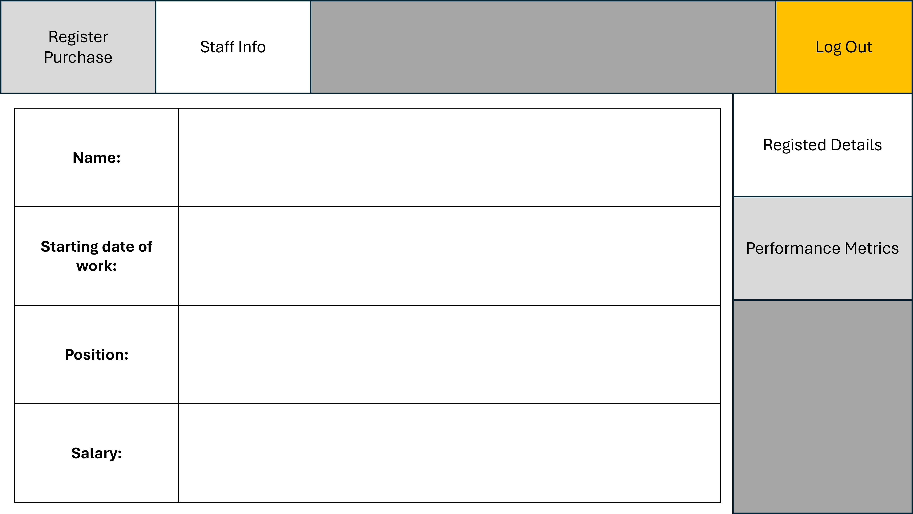
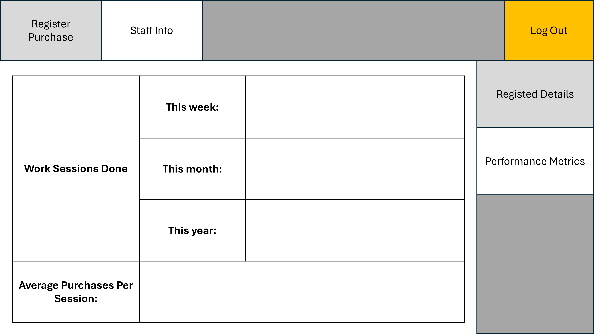
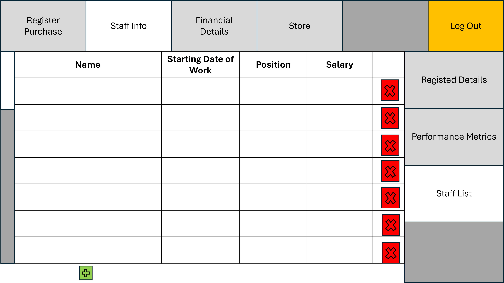

<h1 align="center" style="font-size:24px;">STAFF INFO SCREEN</h1>

This documentation serves as an UI detailer for the staff info tab that staffs and managers have.

The staff info screen has 2 subtabs: the staff's registered details, and the performance metrics. For managers, there is a 3rd subtab to view the staff list.

The shades of gray are just to visualize what tabs we are not on here.

**Registered Details Subtab**

- The entries of this subtab should not be editable (duh).

**Performance Metrics Subtab**

**Special: Manager Staff List Subtab**

- The red x-cross button is used to remove the corresponding staff entry from the list. It should prompt the manager to ensure they know they're deleting the entry.
- The green cross button is used to add a staff to the list.
    - Upon click, prompt the manager to enter the new staff's details: name, starting date of work, position, salary.