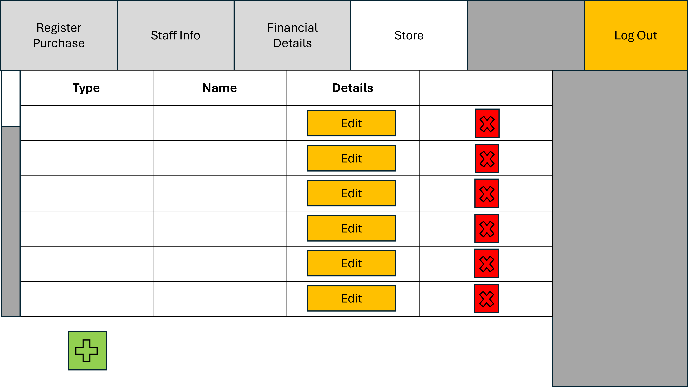
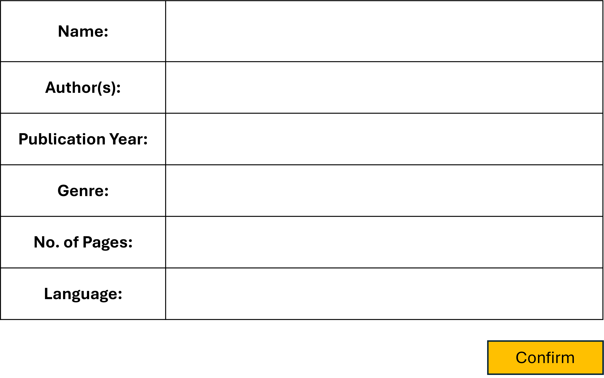
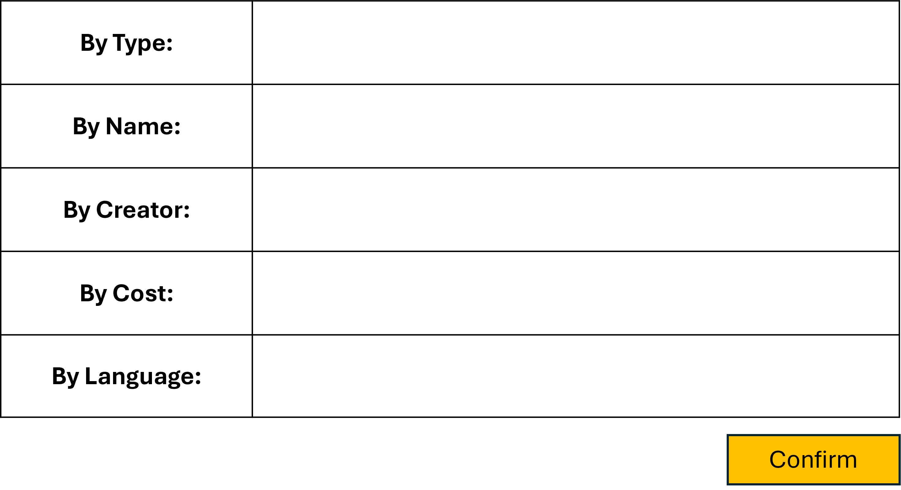

<h1 align="center" style="font-size:24px;">STORE EDIT SCREEN</h1>

This document serves as an UI detailer for the store editing screen, exclusive to managers.

The shades of gray are just to visualize what tabs we are not on here.

- The red x-cross button is used to remove the corresponding entry in the list.
- The green cross button is used to add an entry to the list. 
- For each entry in the store, click the "Edit" button to prompt an editing screen.
  - The editing screen should look something like:

    
  Note that this editing screen is just an example for the Book media type. Please change this screen accordingly for the CD and DVD media types.
  - The editing box of each attribute should be editable.
  - After editing the entries as desired, press confirm to make changes.
  - Confirming changes should update the database directly, and thus, update the store edit screen accordingly.

- The "Find" button, upon click, prompts us with a menu to filter the entries viewed:
    
     - The filters that the manager types in this filter menu should be kept until they close the store viewer menu.
    - After the manager enters some filters and presses "Confirm", the scrollable list of entries in the store viewer should be shrunk accordingly.