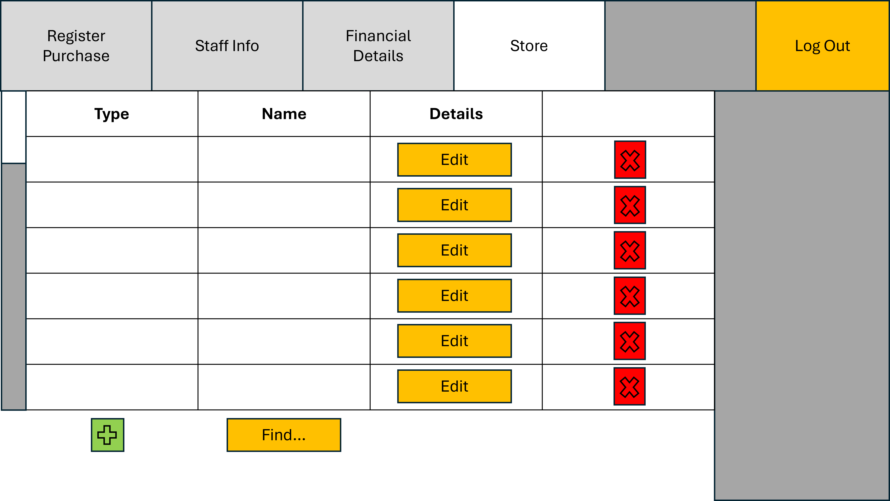

<h1 align="center" style="font-size:24px;">STORE EDIT SCREEN</h1>

- For each entry in the store, click the "Edit" button to prompt an editing screen.
  - The editing screen should look something like:

    
  - After editing the entries as desired, press confirm to make changes.
  - Confirming changes should update the database directly, and thus, update the store edit screen accordingly.

- The red x-cross button is used to remove the corresponding entry in the list.
- The green cross button is used to add an entry to the list. 